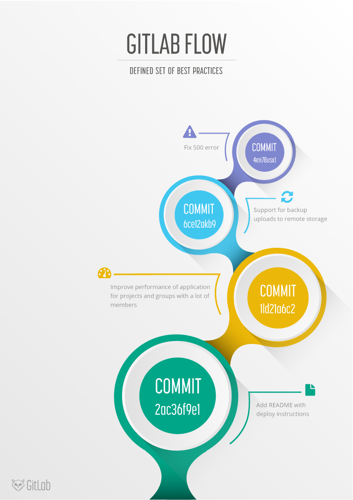

# GitLab Flow

# Introduction to GitLab Flow

깃은 넓고 다양한 종류의 브런치 전략과 워크플로우를 가능하게 합니다.

그렇기 때문에 많은 기관들의 워크플로우는 복잡해지고 명확하지 않으며 이슈 트래킹과 통합되지 않습니다.

그렇기 떄문에 우리는 명확하게 정의된 최고의 사례들로 GitLab Flow를 제시합니다.

이것은 feature-driven development와 feature branches를 이슈 트래킹과 결합니다.

*깃의 다양한 기능과 자유도로 인해 발생하는 문제점으로 인해  GitLab Flow방식을 제시하고 있습니다.

*feature-driven development은 기능 주도 개발을 말합니다.

GitLab Flow방식을 통해  기능 주도 개발방법과 feature branche를 이슈트래킹과 결합한다고 하는데 해당 내용에 대해서는 GitLab Flow에 대하여 좀 더 공부 후 보충하도록 하겠습니다.  

다른 버전 제어 시스템에서 Git을 사용하는 조직은 생산적인 워크 플로를 개발하기가 어렵습니다. 이 문서에서는 Git 워크 플로를 이슈 트래킹과 통합하는 GitLab Flow에 대해 설명합니다. Git을 사용하는 투명하고 효과적인 방법을 제공합니다.

*다른 버전 관리툴을 사용 하다가 Git을 도입하는 경우에  생산적인 워크 플로우를 개발하기 어렵기 떄문에 워크 플로우와 이슈트래킹을 통합하는 GitLab Flow에 대해서 설명하고자 합니다.

Git으로 변환 할 때 동료와 커밋을 공유하려면 세 단계가 필요하다는 사실에 익숙해 져야합니다. 대부분의 버전 제어 시스템에는 작업 복사본에서 공유 서버로 커밋하는 한 단계 만 있습니다. Git에서는 작업 복사본의 파일을 스테이징 영역에 추가합니다. 그런 다음 로컬 저장소에 커밋합니다. 세 번째 단계는 공유 원격 저장소로 푸시하는 것입니다. 이 세 단계에 익숙해지면 다음 과제는 분기 모델입니다.

*다른 버전 관리툴들은 commit을 통해서만 변경내용이 서버에 적용되지만 깃에서는 스테이징 추가, 로컬 저장소에 커밋, 원격 저장소에 푸쉬되는 3가지 과정이 필요합니다.

Git을 처음 접하는 많은 조직에는 작업 방법에 대한 규칙이 없기 때문에 저장소가 금방 지저분해질 수 있습니다. 가장 큰 문제는 모두 변경 사항의 일부를 포함하는 장기 실행 분기가 많이 등장한다는 것입니다. 사람들은 어떤 브랜치에 최신 코드가 있는지 또는 어떤 브랜치를 프로덕션에 배포할지 파악하기가 어렵습니다. 종종이 문제에 대한 반응은 [Git flow](https://nvie.com/posts/a-successful-git-branching-model/) 및 [GitHub flow](http://scottchacon.com/2011/08/31/github-flow.html) 와 같은 표준화 된 패턴을 채택하는 것입니다 . 우리는 여전히 개선의 여지가 있다고 생각합니다. 이 문서에서는 GitLab 흐름이라고하는 일련의 사례를 설명합니다.

이것이 GitLab에서 작동하는 방식에 대한 비디오 소개는 [GitLab Flow를](https://youtu.be/InKNIvky2KE) 참조하십시오 .

*깃의 브런치로 인해서 개발자들은 어떤 브랜치에 최신 코드가 있는지 또는 어떤 브랜치를 프로덕션에 배포할지 파악하기 어려운 문제가 있기에 [Git flow](https://nvie.com/posts/a-successful-git-branching-model/) 및 [GitHub flow](http://scottchacon.com/2011/08/31/github-flow.html)를 채택하여 문제점을 해결하고자 합니다.

해당문서에서는 [Git flow](https://nvie.com/posts/a-successful-git-branching-model/) 및 [GitHub flow](http://scottchacon.com/2011/08/31/github-flow.html) 또한 개선의 여지가 있다고 생각하기에 GitLabFlow를 제시하고 있습니다.

# Git flow and its problems

Git 흐름은 Git 브랜치를 사용하기위한 최초의 제안 중 하나였으며 많은 관심을 받았습니다. 기능, 릴리스 및 핫픽스에 대한 지원 분기뿐만 아니라 `master`분기 및 별도 `develop`분기를 제안합니다 . 개발은 `develop`브랜치에서 발생 하고 릴리스 브랜치로 이동 한 후 최종적으로 `master`브랜치에 병합됩니다 .

*위의 그림과 같이 Git Flow에서는 feature, develope, release, hotfix, master 5가지 브랜치를 사용합니다.

- master : 제품으로 출시될 수 있는 브랜치
- develop : 다음 출시 버전을 개발하는 브랜치
- feature : 기능을 개발하는 브랜치
- release : 이번 출시 버전을 준비하는 브랜치
- hotfix : 출시 버전에서 발생한 버그를 수정 하는 브랜치

    출처 : [https://woowabros.github.io/experience/2017/10/30/baemin-mobile-git-branch-strategy.html](https://woowabros.github.io/experience/2017/10/30/baemin-mobile-git-branch-strategy.html)

Git 흐름은 잘 정의 된 표준이지만 복잡성으로 인해 두 가지 문제가 발생합니다. 첫 번째 문제는 개발자는 develop branch를 필수로 사용하여야 되지만 master branch는 아닙니다.

master branche는 release된 코드를 가지고 있습니다.

 (master is reserved for code that is released to production.)

 기본 브랜치를 호출 `master`하고 대부분이 브랜치를 분기하고 병합 하는 것이 관례 입니다. 대부분의 도구는 자동으로 `master`분기를 기본값 으로 사용하기 때문에 다른 분기로 전환해야하는 번거 로움이 있습니다.

*깃을 사용함에 있어서 개발자들은 develope  branch를 필수로 사용하여야 되지만 대부분의 Tool에서는 master branch를 기본으로 하고 있어서 git swith를 해야 하는 번거로움이 있습니다.

Git 흐름의 두 번째 문제는 핫픽스 및 릴리스 분기에 의해 도입 된 복잡성입니다. 이러한 분기는 일부 조직에는 좋은 아이디어가 될 수 있지만 대다수 조직에서는 과잉입니다. 오늘날 대부분의 조직은 지속적 배포를 실행하므로 기본 브랜치를 배포 할 수 있습니다.

 지속적 배포를 사용하면 소개하는 모든 행사를 포함하여 핫픽스 및 릴리스 분기가 필요하지 않습니다. 

이 의식의 예는 릴리스 분기의 병합입니다.

 이 문제를 해결하기위한 특수 도구가 있지만 문서화가 필요하고 복잡성이 추가됩니다. 

자주, 개발자들은 단지로 변화를 병합 같은 실수 할 `master`아닌로를`develop`분기. 이러한 오류의 이유는 대부분의 사용 사례에서 Git 흐름이 너무 복잡하기 때문입니다. 예를 들어 많은 프로젝트에서 릴리스를 수행하지만 핫픽스를 수행 할 필요는 없습니다.

*복잡한 분기들로 인하여 개발자들에게